# 設計提案（High-level層追加・Low-level維持）

## 方針（要点）

- **Low-level層は現状維持**（Vulkan.hppに近い柔軟さを保持）
- **High-level層は“薄い支援”**（任意利用。強制フレーム化しない）
- **Error Handlingは2層**
  - Low-level: 既存 `Result<T>` / `Error` に準拠
  - High-level: 失敗を収集し、最終的に `Result<T>` で返す

---

## 全体アーキテクチャ（Mermaid）

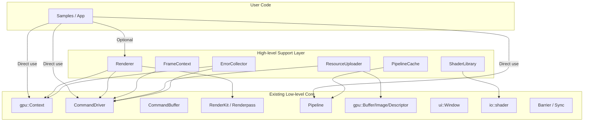

---

## 既存コードとの関係（Mermaid: Mapping）

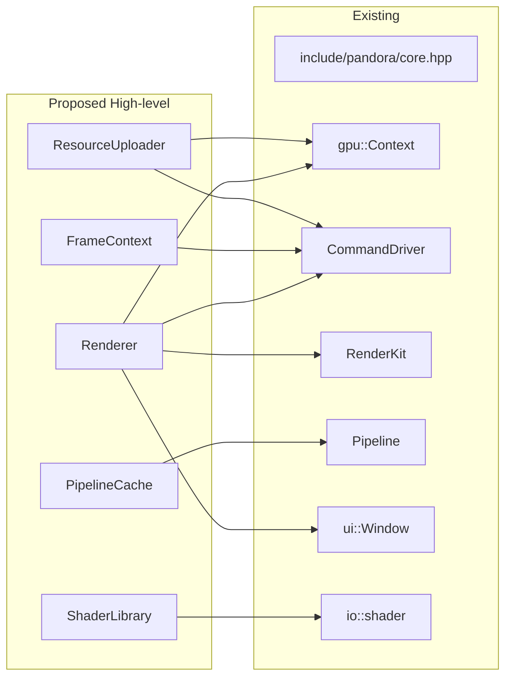

---

## 使い分けの思想（柔軟性を保持）

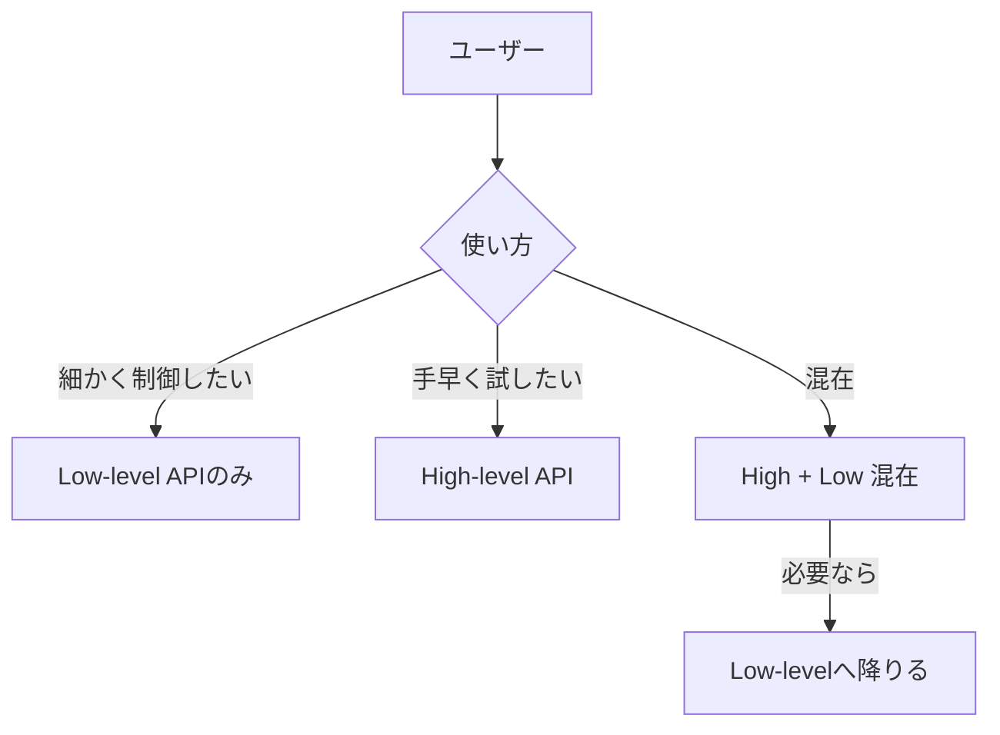

---

## 追加する概念（概要）

- **`Renderer`**: 簡易な描画/フレーム制御入口（内部は既存 `RenderKit` / `CommandDriver`）
- **`FrameContext`**: フレーム同期やSwapchainの細部を隠蔽（必要なら露出も可）
- **`ResourceUploader`**: 転送・バリア・セマフォをテンプレ化
- **`ShaderLibrary`**: SPIR-V読み込みの規約化（現 `io::shader` の上位）
- **`PipelineCache`**: 既存 `Pipeline` を再利用しやすくする薄いキャッシュ

---

# 詳細設計（API境界・責務・既存との接続）

## モジュール責務（Mermaid: 役割分担）

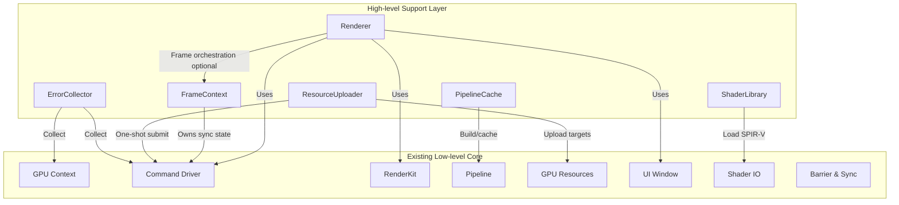

---

## API境界（High-levelは薄く、Low-levelへ逃げられる）

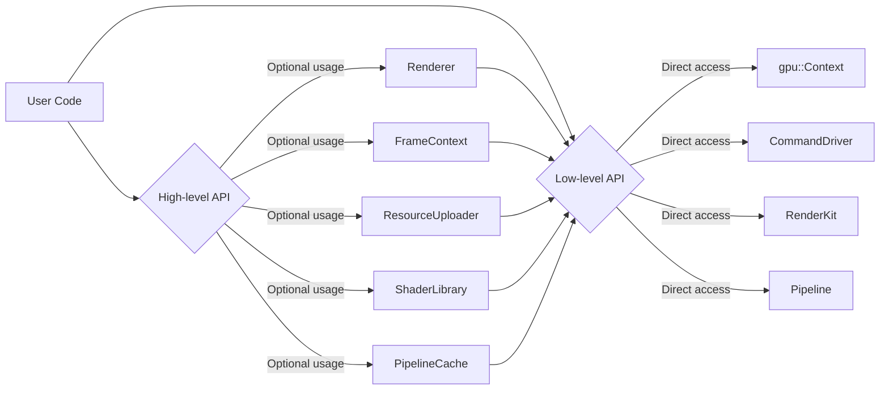

---

## フレーム制御の最小フロー（Mermaid: Sequence）

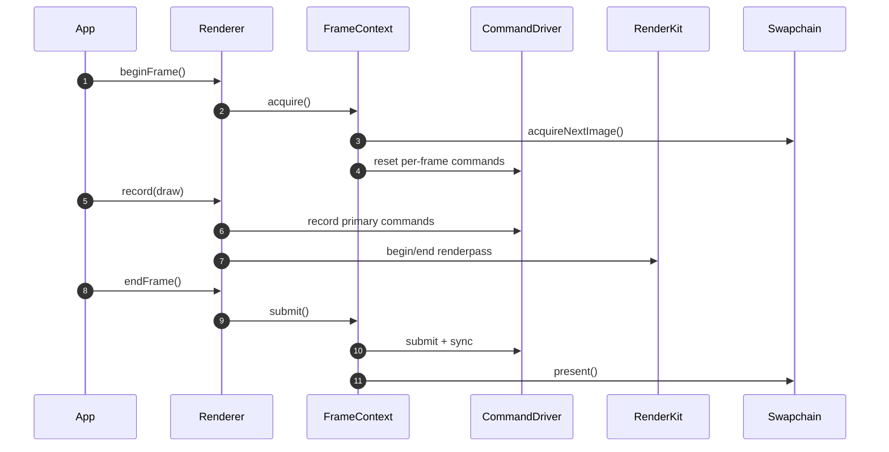

---

## ResourceUploaderの責務（転送・バリアのテンプレ化）

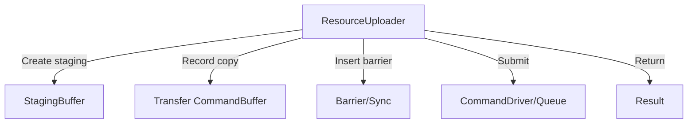

---

## エラーハンドリングの設計（Low/Highの二層）

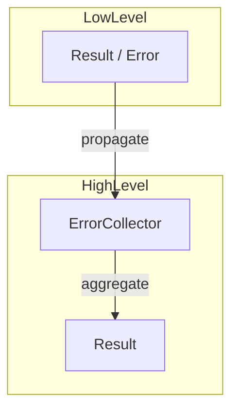

---

## High-level APIの最小利用イメージ（概念）

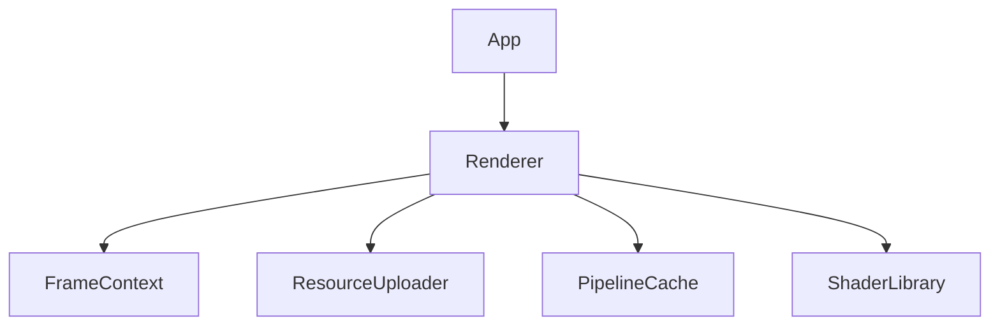

---

## 既存APIとの統合ポイント（差し込み箇所）

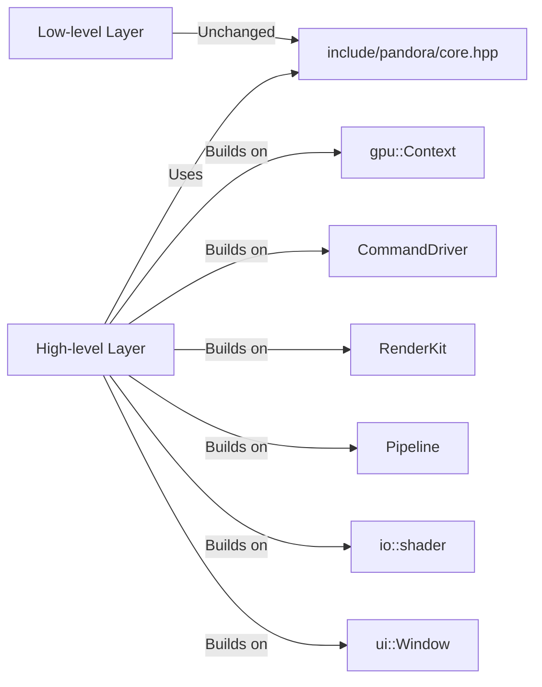

---

## 運用方針（混在運用の前提）

- High-levelは**強制しない**。Low-levelだけで完結可能。
- High-level使用中でも、**局所的にLow-levelへ降りる**ことを想定。
- High-levelは**小さく・明示的**に保ち、抽象化の過剰化を避ける。

---

## 次の設計フェーズ（提案）

1. **API命名と公開ヘッダ配置方針の確定**
2. **最小サンプル（10〜20行相当）の構築方針決定**
3. **ErrorCollectorの責務と`Result<T>`変換規約の明文化**
4. **ResourceUploaderの対応範囲（Buffer/Image/Blit/Readback）の確定**

---

# 次フェーズ詳細設計（API命名・公開ヘッダ・最小フロー）

## 公開ヘッダ構成（案）

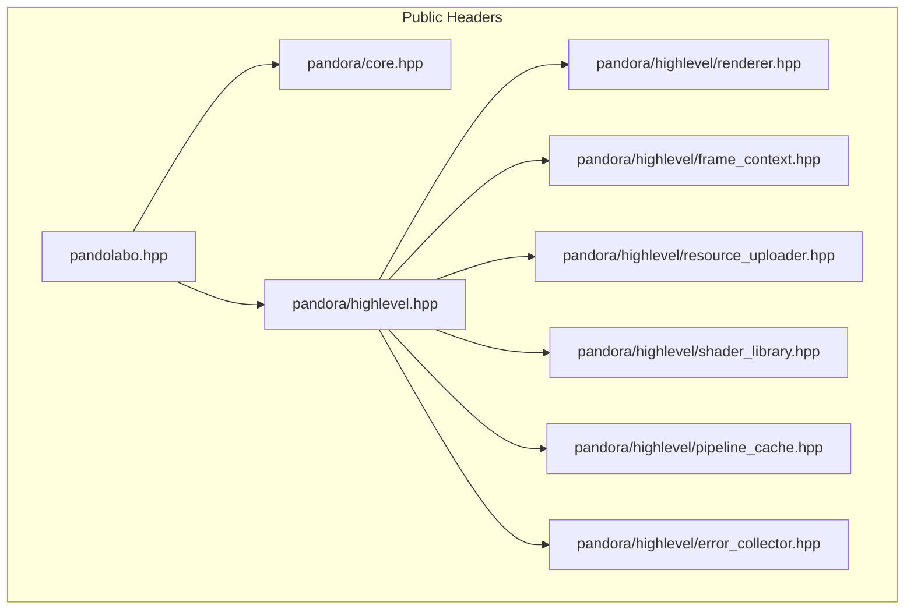

---

## API命名方針（低レベルの柔軟性を維持）

- High-levelは **短い名詞 + 明示的メソッド** を採用（例: `Renderer`, `FrameContext`）。
- 低レベル型の別名・再ラップは行わない（既存APIの可視性を保持）。
- High-levelは **`create*()` ではなく `build*()` / `prepare*()`** を優先し、
  低レベルの `construct*()` と衝突しないようにする。

---

## 最小利用フロー（概念）

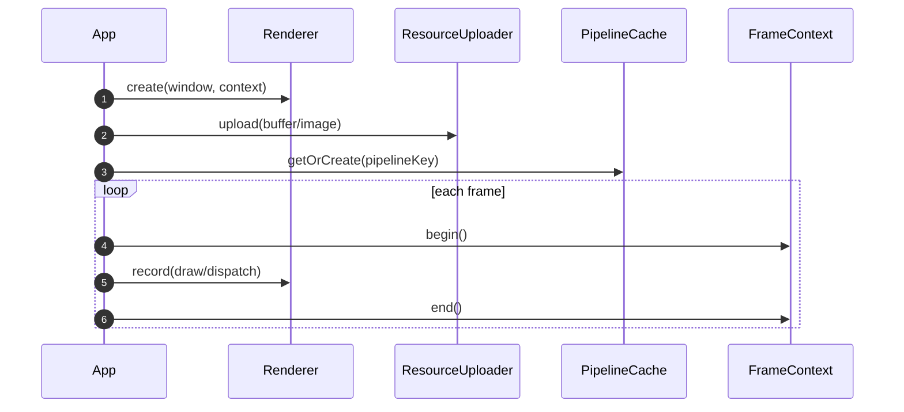

---

## 最小サンプル（書きやすさの比較）

### Before（Low-level中心）

```cpp
// English comments only
auto window = std::make_unique<pandora::core::ui::Window>("Sample", 800, 600);
auto context = std::make_unique<pandora::core::gpu::Context>(window->getWindowSurface());

auto graphicsDriver = std::make_unique<pandora::core::CommandDriver>(
    context, pandora::core::QueueFamilyType::Graphics);

// Many explicit steps: renderpass, pipeline, buffers, barriers, sync...
// Record command buffers and submit each frame.
```

### After（High-level併用）

```cpp
// English comments only
auto window = std::make_unique<pandora::core::ui::Window>("Sample", 800, 600);
auto context = std::make_unique<pandora::core::gpu::Context>(window->getWindowSurface());

pandora::highlevel::Renderer renderer{window.get(), context.get()};
pandora::highlevel::ResourceUploader uploader{context.get()};
pandora::highlevel::PipelineCache pipelineCache{context.get()};

// Upload resources with one call
uploader.uploadBuffer(vertexBuffer, vertexData);

while (window->update()) {
  auto frame = renderer.beginFrame();
  renderer.record(frame, [&](pandora::highlevel::RenderPassScope& pass) {
    pass.bindPipeline(pipelineCache.getOrCreate(pipelineKey));
    pass.draw(verticesCount);
  });
  renderer.endFrame(frame);
}
```

### 目標（定量イメージ）

- 主要手順の行数を **$\frac{1}{2}$ 〜 $\frac{1}{3}$** に縮小
- 「同期・バリア・転送」の**記述を明示的に減らす**（ただし逃げ道は残す）

---

## ErrorCollectorの責務（明文化）

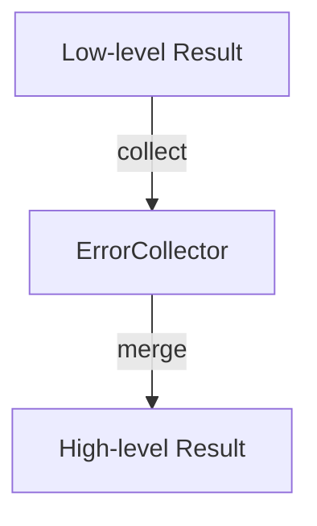

### ルール

- Low-levelの `Result<T>` を**必ず保持**し、High-levelで失敗を隠蔽しない。
- High-levelは `ErrorCollector` に集約し、呼び出し境界で `Result<T>` に変換する。

---

## ResourceUploaderの対応範囲（案）

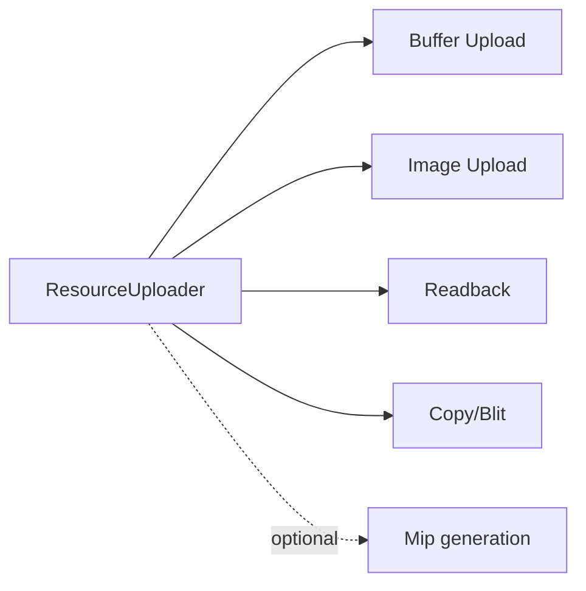

---

## High-levelとLow-levelの共存指針（明文化）

- High-levelは**薄い“作業短縮”**としてのみ機能させる。
- Low-level APIへの**エスケープを常に可能**にする。
- High-levelは**フレームループの固定化をしない**（利用者が保持できる）。

---

# High-level API仕様（クラス/メソッド一覧・設計仕様）

## クラス構成（Mermaid: classDiagram）

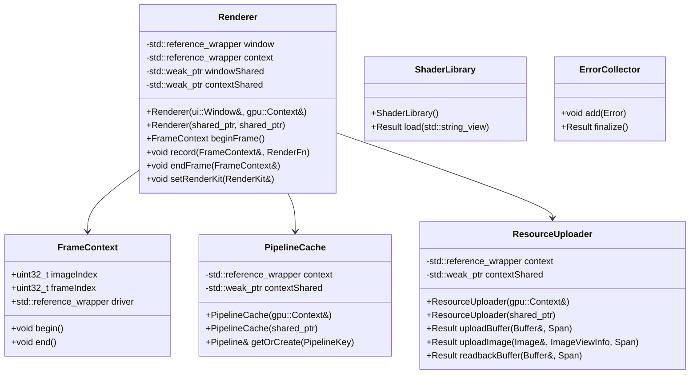

---

## メソッド設計の意図（簡潔）

### `Renderer`

- `beginFrame()` / `endFrame()` はフレーム同期の薄いラップ。
- `record()` は **コマンド記録をラムダで受ける**だけで、Low-levelの直接操作も可能。
- `setRenderKit()` で既存 `RenderKit` を差し込み可能。

### `FrameContext`

- **フレーム毎の状態**（imageIndex, frameIndex, driver）だけを保持。
- `begin()` / `end()` は **必須ではない**が、簡易フローでの利便性を担保。

### `ResourceUploader`

- **転送のテンプレ化**のみを提供。
- バリアやセマフォは内部で最小限に挿入し、詳細制御はLow-levelで行う。

### `PipelineCache`

- パイプラインの生成コストを隠蔽しつつ、**キー設計はユーザー側**に残す。

### `ShaderLibrary`

- 既存 `io::shader` を包む薄いローダ。
- 失敗は `Result<ShaderModule>` で返し、例外隠蔽は行わない。

### `ErrorCollector`

- High-level内部の失敗を集約し、最後に `Result<T>` に変換する。

---

## API境界の厳密化（ルール）

- High-levelは **所有権を奪わない**（`Context`/`Window` は参照保持）。
- High-levelは **低レベル型の型名・値を露出**できることを保証する。
- High-levelは **例外で握りつぶさない**（`Result<T>` の維持）。

---

## メンバ保持ポリシー（rawポインタ回避）

- High-levelのクラスメンバは **rawポインタを保持しない**。
- 非所有参照は `std::reference_wrapper<T>` または `std::weak_ptr<T>` を使用する。
- API引数は `T&` または `const std::unique_ptr<T>&` を受け、
  内部では `std::reference_wrapper<T>` に保持する。
- 共有所有が必要な場合のみ `std::shared_ptr<T>` を受け、内部では `std::weak_ptr<T>` に保持する。

---

# 実装優先度ロードマップ

## フェーズ0（安全性の基盤）

- rawポインタのメンバ保持を排除（Window/Barrier Builders対応済み）
- 参照保持ポリシーを既存コードへ適用

## フェーズ1（最小High-level導入）

- `Renderer` / `FrameContext` の最小実装
- `ResourceUploader` の **Buffer Upload/Readback** まで
- 最小サンプル（Square相当）をHigh-levelで書き直し

## フェーズ2（描画系の実用化）

- `RenderPassScope` の導入（record内の簡易操作）
- `PipelineCache` と `ShaderLibrary` を正式導入
- Basic Cube をHigh-level併用で再構成

## フェーズ3（Compute/Transfer拡張）

- `ResourceUploader` の Image Upload / Blit / Mip 追加
- Compute例をHigh-level併用へ移行

## フェーズ4（エコシステム整備）

- エラーハンドリング統合
- テストとサンプルの整合性チェック自動化
- ドキュメント刷新

---

# エラーハンドリング実装詳細設計

## 目標

- Low-levelの `Result<T>` を **保持**し、High-levelで隠蔽しない。
- High-levelは複数の失敗を収集し、**1回の `Result<T>` に集約**できる。

## ErrorCollectorの振る舞い（Mermaid）

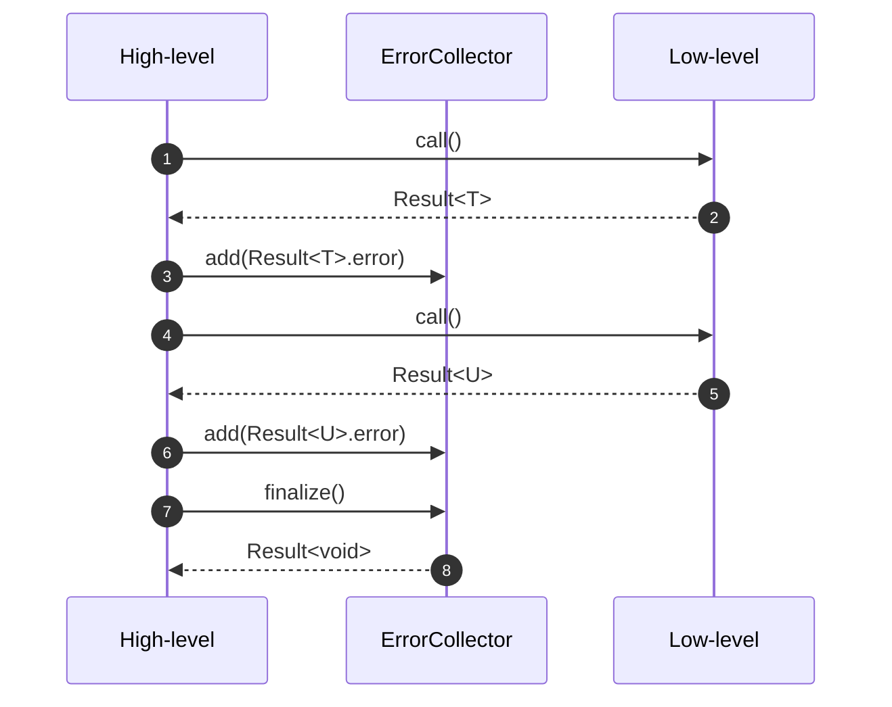

## ルール（実装指針）

- `Result<T>` の `error` は **そのまま保持**（wrapのみ許可）
- High-levelの関数は **成功/失敗を必ず返す**（例外隠蔽は禁止）
- `ErrorCollector` は **非スロー**であること（集約は例外にしない）

---

# テスト方針（既存含めて）

## 対象

- 既存 Low-level テストを維持
- High-level追加分のユニットテストを新規追加
- サンプルが **最小構成で動く**ことを確認

## テストレイヤ

1. **Unit**: High-level各クラスの単体検証（依存はモック最小）
2. **Integration**: 既存GPUテストを利用（`PANDOLABO_ENABLE_GPU_TESTS`）
3. **Examples**: Square/Cube/Computeを回帰テスト対象にする

## 運用ルール

- GPU無し環境では Unit だけ通る構成
- GPU有り環境では Integration/Examples を追加実行
- 既存テストを**必ず残し、動作互換性を担保**
