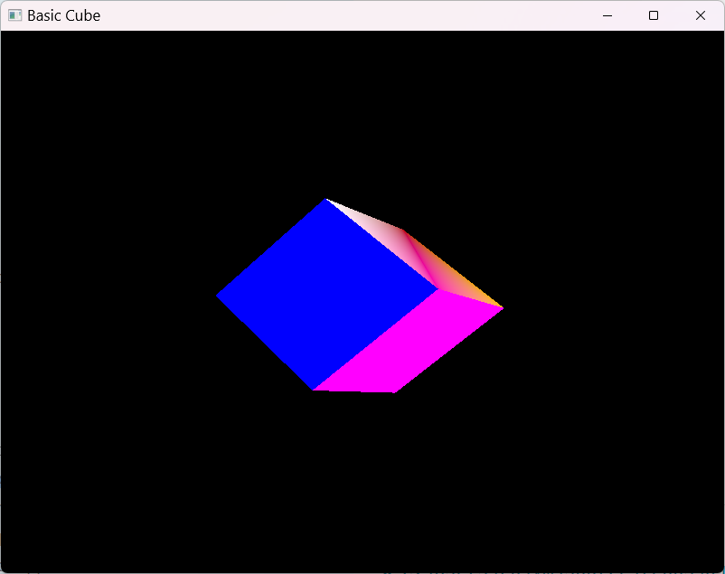

# Basic Cube Example

## 概要

Pandolaboライブラリを使用した3Dキューブのレンダリングサンプルです。頂点バッファ、シェーダー、レンダーパスを使用した基本的な3Dグラフィックスレンダリングの方法を示しています。

## 特徴

- **3Dレンダリング**: 3Dキューブの描画
- **頂点バッファ**: 3D頂点データの管理
- **MVP変換**: Model-View-Projection行列による座標変換
- **深度テスト**: Z-bufferを使用した正しい深度処理
- **リアルタイムレンダリング**: 60FPSでの継続的な描画

## ファイル構成

- `main.cpp` - アプリケーションのエントリーポイント
- `basic_cube.hpp` - BasicCubeクラスの宣言
- `basic_cube.cpp` - BasicCubeクラスの実装
- `cube.vert` - 頂点シェーダー（GLSL）
- `cube.frag` - フラグメントシェーダー（GLSL）

## 学習ポイント

1. **グラフィックスパイプライン**: Vulkanグラフィックスパイプラインの構築
2. **頂点データ**: 頂点バッファとインデックスバッファの使用
3. **シェーダー**: 頂点シェーダーとフラグメントシェーダーの連携
4. **ユニフォームバッファ**: MVP行列の転送と更新
5. **レンダーパス**: カラーアタッチメントと深度アタッチメント
6. **ウィンドウシステム**: GLFWとVulkanサーフェスの統合

## ビルドと実行

```powershell
# プロジェクトルートから
.\scripts\build.ps1

# 実行メニューで "7" を選択してExampleをビルド・実行
# または直接実行
.\build\examples\Release\example_basic_cube.exe
```

## 動作

このexampleは以下の処理を実行します：

1. GLFWウィンドウとVulkanサーフェスを作成
2. グラフィックスパイプラインを初期化
3. キューブの頂点データと色データを設定
4. MVP行列を計算してユニフォームバッファに転送
5. リアルタイムでキューブをレンダリング
6. ウィンドウが閉じられるまで描画ループを継続

## レンダリング内容

- **カラフルなキューブ**: 各面が異なる色で描画
- **3D回転**: 時間に応じてキューブが回転
- **遠近投影**: 奥行き感のある3D表示
- **深度テスト**: 正しい前後関係での描画



## 関連技術

- **Vulkan Graphics Pipeline**
- **GLSL Vertex/Fragment Shaders**
- **MVP Matrix Transformations**
- **Depth Buffer and Testing**
- **GLFW Window Management**
- **Vulkan Surface and Swapchain**
