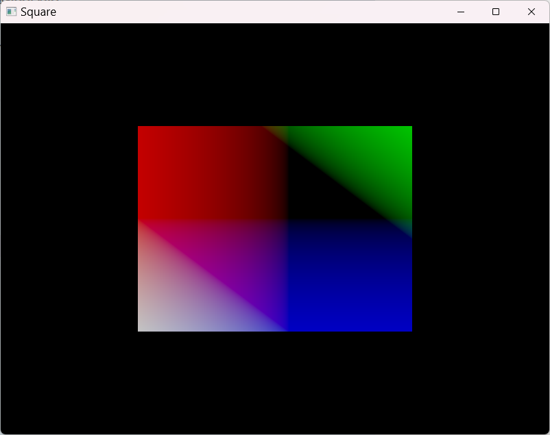

# Square Example

## 概要

Pandolaboライブラリを使用した2D四角形レンダリングの基本的なサンプルです。最もシンプルなグラフィックスレンダリングの実装を通じて、Vulkanパイプラインの基礎概念を学習できます。

## 特徴

- **シンプルな2D描画**: 基本的な四角形の描画
- **最小構成**: 必要最小限のVulkanセットアップ
- **頂点バッファ**: 基本的な頂点データの使用
- **フラットシェーディング**: 単色での塗りつぶし描画

## ファイル構成

- `main.cpp` - アプリケーションのエントリーポイント
- `square.hpp` - Squareクラスの宣言
- `square.cpp` - Squareクラスの実装
- `square.vert` - 頂点シェーダー（GLSL）
- `square.frag` - フラグメントシェーダー（GLSL）

## 学習ポイント

1. **基本的なグラフィックスパイプライン**: 最小構成でのパイプライン構築
2. **頂点データ**: 2D座標と基本的な頂点属性
3. **シェーダーの基礎**: 最もシンプルな頂点・フラグメントシェーダー
4. **描画コマンド**: 基本的な描画コマンドの発行
5. **ウィンドウレンダリング**: ウィンドウへの直接描画

## ビルドと実行

```powershell
# プロジェクトルートから
.\scripts\build.ps1

# 実行メニューで "7" を選択してExampleをビルド・実行
# または直接実行
.\build\examples\Release\example_square.exe
```

## 動作

このexampleは以下の処理を実行します：

1. GLFWウィンドウとVulkanサーフェスを初期化
2. 最小構成のグラフィックスパイプラインを作成
3. 四角形の頂点データを設定
4. リアルタイムで四角形を描画
5. ウィンドウが閉じられるまで描画ループを継続

## レンダリング内容

- **単色の四角形**: シンプルな色で塗りつぶされた四角形
- **画面中央配置**: ウィンドウの中央に配置
- **静的表示**: 回転やアニメーションなしの静的描画



## 初心者向けの特徴

このexampleは以下の理由で初心者に最適です：

- **複雑性の排除**: 3D変換、テクスチャ、複雑なシェーダーなし
- **コード量最小**: 理解しやすい短いコード
- **基本概念重視**: Vulkanの基本的な流れに集中
- **デバッグしやすさ**: 問題の特定が容易

## 次のステップ

このexampleを理解したら、以下に進むことをお勧めします：

1. **Basic Cube Example** - 3D描画とMVP変換
2. **Basic Compute Example** - コンピュートシェーダーの基礎
3. **Computing Image Example** - 画像処理とテクスチャ

## 関連技術

- **Vulkan Graphics Pipeline Basics**
- **GLSL Shader Fundamentals**
- **2D Vertex Buffer Management**
- **Basic Rendering Loop**
- **GLFW Window Integration**
